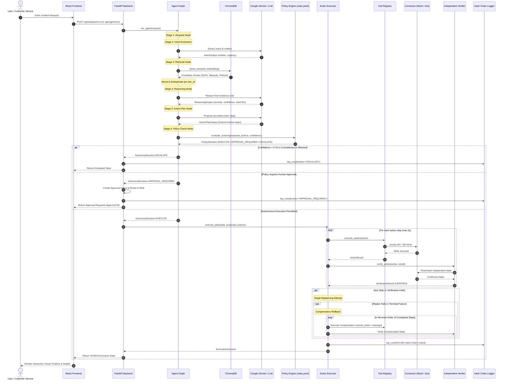

# VERIXA: Evidence-to-Action Enterprise AI Agent
## Complete System Architecture & Exhaustive File-by-File Technical Documentation

---

## 1. Executive Summary & Architecture Overview

**VERIXA** is an enterprise-grade, policy-aware, risk-controlled, and evidence-backed AI workflow automation platform designed specifically for high-stakes customer and field-service incident resolution. 

Unlike traditional Retrieval-Augmented Generation (RAG) chatbots that merely answer questions, or unbounded autonomous agents that execute arbitrary tools, VERIXA enforces strict architectural boundaries:
> **Request → Intent Extraction → Evidence Retrieval → Reasoning → Action Planning → Deterministic Policy Check → Safe Execution / Human Approval Gate / Automatic Escalation → Independent Verification → Tamper-Evident Hash-Linked Audit**

### Key System Guarantees
1. **Model Proposes, Deterministic Code Authorizes**: Large Language Models (LLMs) suggest actions based on evidence, but cannot authorize execution. Deterministic Python policies govern every write operation.
2. **Evidence Gating & Grounding**: Actions must cite specific retrieved document IDs. If evidence confidence falls below a strict threshold (default `0.70`), or if documents contradict one another, the agent automatically halts and escalates to a human operator.
3. **Compensatory Rollback**: If multi-step action execution fails at any intermediate stage or fails independent post-execution verification, a rollback mechanism automatically fires compensating transactions (e.g., cancelling created tickets or unassigning field technicians).
4. **Tamper-Evident Cryptographic Audit Chain**: Every run, decision, tool invocation, and verification outcome is written to an immutable SQLite audit log linked via SHA-256 hash pointers (`prev_hash` → `row_hash`), anchored by a genesis hash and a monitored chain head.
5. **Multi-Tier Approval Routing**: Actions exceeding financial thresholds or high risk levels trigger time-bounded approval workflows routing across configured roles (e.g., `service_manager`, `finance_manager`, `risk_director`) via Slack Block Kit and HMAC-signed email confirmation links.

---

## 2. Technology Stack & Tooling

| Layer | Technologies & Libraries | Key Responsibilities |
|---|---|---|
| **Backend Core & Web** | Python 3.12, FastAPI, Uvicorn, Pydantic v2, Pydantic-Settings | Asynchronous REST API, schema validation, dependency injection, and application lifecycle management. |
| **LLM & Inference** | Google Gemini (`google-genai` SDK), OpenRouter (`openai` SDK) | Structured entity extraction, diagnostic reasoning, and bounded action planning. |
| **Vector Database & RAG** | ChromaDB (`chromadb` PersistentClient) | Embedding generation, chunk storage, semantic similarity search, and document-type boosting. |
| **Relational Database** | SQLite, `aiosqlite`, Python `sqlite3` (WAL mode) | Operational state persistence (`runs`, `actions`, `approvals`, `shadow_runs`), hash-chained audit trails, and mock enterprise ERP data. |
| **Document Processing** | `pypdf`, Regex, Markdown parsers | Parsing engineering SOPs, operating manuals, policy rules, and historical incident logs. |
| **HTTP & External Integrations** | `httpx`, `tenacity` | Asynchronous communication with external systems, Jira Cloud REST API connector, Slack webhooks, and retry logic. |
| **Testing & Quality** | `pytest`, `pytest-asyncio`, `ruff`, Node.js test runner | Async unit testing, scenario verification, linting, code formatting, and end-to-end integration tests. |
| **Frontend Framework** | React 19, TypeScript 6, Vite 8, React Router v7 | Single Page Application (SPA), state management, routing, and asynchronous API polling. |
| **Styling & Design System** | Tailwind CSS v4, `tw-animate-css`, Lucide React, Phosphor Icons | Sleek dark-mode aesthetic, responsive layouts, glassmorphism, and status badges. |
| **UI Components & Animation** | Radix UI primitives, Framer Motion, Shadcn UI | Accessible dialogs, scroll areas, custom sliders, confidence meters, and interactive pipeline timelines. |

---

## 3. Directory Hierarchy

```
VERIXA/
├── .env / .env.example              # Environment variables & runtime configurations
├── README.md                        # Project overview, quick-start guide, and architecture
├── RULES.md                         # Autonomous agent pair-programming constraints
├── pyproject.toml                   # Root backend package configuration & dependencies
├── backend/
│   ├── app/
│   │   ├── main.py                  # FastAPI application entrypoint & lifecycle hooks
│   │   ├── agent/                   # Multi-stage graph orchestrator, executor, replanner, shadow mode
│   │   ├── analytics/               # Audit-derived KPI aggregations & operational savings metrics
│   │   ├── api/                     # REST API routers (Agent, Approval, Audit, Policy, Shadow, Chat, Analytics)
│   │   ├── approvals/               # Multi-tier approval routing, escalation timers, Slack/Email notifiers
│   │   ├── audit/                   # SHA-256 cryptographic hash-chain logging & verification
│   │   ├── chat/                    # Tenant-scoped conversational assistant & documentation QA
│   │   ├── connectors/              # ERP & ticketing connectors (Mock connector & Jira Cloud API)
│   │   ├── core/                    # Application settings, constants, enums, database initialization
│   │   ├── feedback/                # Human review store, knowledge gap logging, policy suggestions
│   │   ├── knowledge/               # Document chunking, ChromaDB ingestion, retrieval, conflict detection
│   │   ├── llm/                     # Multi-provider LLM abstraction layer (Gemini & OpenRouter)
│   │   ├── models/                  # Pydantic v2 schemas and domain models
│   │   ├── policy/                  # Deterministic YAML policy engine, versioning, offline replay simulator
│   │   ├── tools/                   # Registered enterprise tools (Tickets, Techs, Customers, Notifications)
│   │   └── verification/            # Post-execution independent state verification engine
│   └── tests/                       # Comprehensive pytest suite across all system modules
├── data/
│   ├── customers.json               # Seed customer enterprise directory & warranty contracts
│   ├── technicians.json             # Seed field technician roster, skills & territory availability
│   ├── external/                    # External reference documents (aviation maintenance reports)
│   └── knowledge/                   # Markdown enterprise repository (SOPs, Manuals, Policies, Incidents)
├── docs/
│   ├── implementation_plan.md       # Complete 36-hour hackathon architectural specification
│   └── CODEBASE_DOCUMENTATION.md    # This master reference document
├── frontend/
│   ├── index.html / package.json    # Vite web entrypoint, frontend scripts & dependencies
│   ├── vite.config.ts               # Vite bundler configuration & path aliases
│   ├── src/
│   │   ├── App.tsx / main.tsx       # Root React component, router configuration & stylesheet imports
│   │   ├── index.css                # Global design system, dark palette & typography
│   │   ├── components/              # Shell, timeline, confidence gauge, landing page sections, UI primitives
│   │   ├── lib/                     # Client utilities (cn class merge, local storage run persistence)
│   │   ├── pages/                   # Application pages (Workspace, Decisions, Approvals, Audit, Policy, etc.)
│   │   └── services/                # Typed API client layer for backend endpoints
├── scripts/
│   ├── seed.py                      # Database & ChromaDB vector store seeding pipeline
│   └── import_history.py            # Historical case CSV importer for shadow evaluation
└── tests/
    └── api/scenarios.spec.ts        # Node.js end-to-end integration test runner
```

---

## 4. Exhaustive File-by-File Catalog

### 4.1. Root Configuration & Project Documentation

#### [README.md](file:///s:/hackathon%20project/VERIXA/README.md)
- **Role**: Primary repository README.
- **Functionality**: Summarizes the system's purpose, quick-start setup instructions for backend (`uv`, `fastapi`, `uvicorn`) and frontend (`npm`, `vite`), high-level request-to-audit architecture diagram, tech stack table, and directory tree.
- **Technologies**: GitHub Markdown.

#### [RULES.md](file:///s:/hackathon%20project/VERIXA/RULES.md)
- **Role**: AI developer and pair-programming constraint guide.
- **Functionality**: Specifies coding conventions: strict adherence to the implementation roadmap, typed Pydantic models, prohibition of placeholder logic, test-driven validation, and reliance on open-source/local mock implementations rather than paid cloud services.
- **Technologies**: Markdown.

#### [.env / .env.example](file:///s:/hackathon%20project/VERIXA/.env.example)
- **Role**: Runtime environment configuration template and active secrets.
- **Functionality**: Defines environment variables consumed by `Settings`:
  - LLM credentials (`GEMINI_API_KEY`, `OPENROUTER_API_KEY`, model names).
  - Storage paths (`DATABASE_URL`, `CHROMA_PERSIST_DIR`, `CHROMA_COLLECTION`).
  - Connector configurations (`CONNECTOR_PROVIDER`, `JIRA_BASE_URL`, `JIRA_EMAIL`, `JIRA_API_TOKEN`).
  - Approval notifier channels (`SLACK_BOT_TOKEN`, `SLACK_SIGNING_SECRET`, `SMTP_HOST`, `SMTP_PORT`).
  - Presentation constants (`ANALYTICS_MINUTES_PER_CASE`, `ANALYTICS_COST_PER_HOUR`).
- **Technologies**: Dotenv configuration.

#### [docs/implementation_plan.md](file:///s:/hackathon%20project/VERIXA/docs/implementation_plan.md)
- **Role**: Comprehensive architectural specification and hackathon blueprint.
- **Functionality**: Details product positioning, domain focus (field-service incident resolution), 13 phased milestones, API specifications, sequence diagrams, and evaluation rubrics.
- **Technologies**: Markdown.

---

### 4.2. Backend Core Layer (`backend/app/core/`)

#### [backend/pyproject.toml](file:///s:/hackathon%20project/VERIXA/backend/pyproject.toml)
- **Role**: Python project metadata and package manifest.
- **Functionality**: Declares application dependencies (`fastapi`, `uvicorn`, `pydantic`, `google-genai`, `openai`, `chromadb`, `aiosqlite`, `pypdf`, `httpx`, `tenacity`), dev dependencies (`pytest`, `pytest-asyncio`, `ruff`), and tool settings (pytest asyncio mode and ruff lint rules).
- **Technologies**: TOML, uv, pip.

#### [backend/app/main.py](file:///s:/hackathon%20project/VERIXA/backend/app/main.py)
- **Role**: FastAPI application root and ASGI web server entrypoint.
- **Functionality**:
  - Initializes structured logging formats.
  - Manages asynchronous application lifecycle (`lifespan` context manager): creates database tables via `init_db()`, dynamically loads tool modules to register decorators.
  - Mounts CORS middleware allowing communication with the Vite dev server (`http://localhost:5173`).
  - Mounts aggregated API router under prefix `/api`.
  - Exposes root health probe endpoint `GET /api/health`.
- **Technologies**: FastAPI, Starlette, Uvicorn, Python `logging`.

#### [backend/app/core/config.py](file:///s:/hackathon%20project/VERIXA/backend/app/core/config.py)
- **Role**: Centralized runtime configuration.
- **Functionality**: Implements `Settings` using `pydantic_settings.BaseSettings`, parsing environment variables from `.env` with validation, type coercion, and sensible defaults. Computes derived project paths (`project_root`, `data_dir`).
- **Technologies**: Pydantic Settings, Python `pathlib`.

#### [backend/app/core/constants.py](file:///s:/hackathon%20project/VERIXA/backend/app/core/constants.py)
- **Role**: Global constants, string enumerations, and system limits.
- **Functionality**:
  - `RiskLevel` (`LOW`, `MEDIUM`, `HIGH`, `UNKNOWN`): Action risk classification.
  - `AutonomyDecision` (`EXECUTE`, `APPROVAL_REQUIRED`, `ESCALATE`): High-level system outcomes.
  - `ActionStatus`: State machine for action execution (`PENDING`, `APPROVED`, `EXECUTING`, `COMPLETED`, `VERIFIED`, `FAILED`).
  - `ApprovalStatus`: Human approval states (`PENDING`, `APPROVED`, `REJECTED`).
  - `DocumentType`: Document categorization (`SOP`, `MANUAL`, `POLICY`, `INCIDENT`).
  - `Severity`: Incident priority (`LOW`, `MEDIUM`, `HIGH`, `CRITICAL`).
  - System limits (`MAX_AGENT_ITERATIONS = 10`, registry tool name constants).
- **Technologies**: Python `enum.StrEnum`.

#### [backend/app/core/database.py](file:///s:/hackathon%20project/VERIXA/backend/app/core/database.py)
- **Role**: Database connection pool and schema management.
- **Functionality**:
  - Resolves SQLite relative URLs safely against the backend package directory.
  - `init_db()`: Idempotently creates core relational tables: `runs`, `actions`, `approvals`, `audit_events`.
  - `get_db()`: Context manager supplying SQLite connections with WAL (`Write-Ahead Logging`) journaling and `sqlite3.Row` dict-like cursor factory.
- **Technologies**: SQLite, Python `sqlite3`, Context Managers.

---

### 4.3. Data Models & Schemas (`backend/app/models/`)

#### [backend/app/models/__init__.py](file:///s:/hackathon%20project/VERIXA/backend/app/models/__init__.py)
- **Role**: Schema namespace exporter.
- **Functionality**: Re-exports all Pydantic models for clean imports throughout the app.

#### [backend/app/models/schemas.py](file:///s:/hackathon%20project/VERIXA/backend/app/models/schemas.py)
- **Role**: Single source of truth for domain data transfer objects (DTOs).
- **Functionality**:
  - `EvidenceItem`: Grounded retrieval chunk with score, citation lines, document type, and conflict flags.
  - `ActionContract`: Structured tool action schema with parameters, justification, cited evidence IDs, and risk level.
  - `ActionResult`: Result payload from tool execution with error details.
  - `PolicyResult`: Outcome of deterministic rule checks (allowed, approval required, matched policy name).
  - `AgentState`: Comprehensive immutable state object flowing through graph nodes, tracking stage statuses, entities, reasoning summary, decisions, and execution results.
  - `ApprovalRequest` & `ApprovalDecision`: Human authorization records.
  - `AuditEvent`: Individual audit log entry.
  - `AgentRunRequest` & `AgentRunResponse`: REST API contract for running the agent pipeline.
  - `HealthResponse`: Status indicator payload.
- **Technologies**: Pydantic v2 (`BaseModel`, `Field`, `ConfigDict`).

---

### 4.4. LLM Abstraction Layer (`backend/app/llm/`)

#### [backend/app/llm/__init__.py](file:///s:/hackathon%20project/VERIXA/backend/app/llm/__init__.py)
- **Role**: LLM module namespace exporter.

#### [backend/app/llm/provider.py](file:///s:/hackathon%20project/VERIXA/backend/app/llm/provider.py)
- **Role**: Vendor-agnostic LLM interface with automatic retry and JSON schema enforcement.
- **Functionality**:
  - `LLMProvider` (ABC): Defines abstract methods `generate()` and `structured_output()`. Implements `extract_json()` and `structured_model()` which serializes Pydantic schemas, validates outputs, and executes a one-time self-correcting retry upon schema violation.
  - `GeminiProvider`: Connects to Google Gemini API using official `google-genai` SDK (`gemini-2.0-flash`).
  - `OpenRouterProvider`: Connects to OpenRouter or OpenAI-compatible inference endpoints using `openai.AsyncOpenAI`.
  - `get_llm()`: Singleton factory returning the active provider according to settings.
- **Technologies**: Google GenAI SDK, OpenAI SDK, Pydantic, Python `abc`.

---

### 4.5. Knowledge Management & Vector Retrieval (`backend/app/knowledge/`)

#### [backend/app/knowledge/__init__.py](file:///s:/hackathon%20project/VERIXA/backend/app/knowledge/__init__.py)
- **Role**: Knowledge package namespace.

#### [backend/app/knowledge/ingestion.py](file:///s:/hackathon%20project/VERIXA/backend/app/knowledge/ingestion.py)
- **Role**: Document parsing, chunking, and ChromaDB vector persistence.
- **Functionality**:
  - Scans `data/knowledge/` subdirectories (`sops/`, `manuals/`, `policies/`, `incidents/`).
  - Chunks markdown files along logical header sections (`# `, `## `), tracking exact line boundaries (`start_line`, `end_line`).
  - Extracts front-matter metadata (Document ID, Version, Effective Date).
  - Generates stable content hashes and bulk inserts document chunks and embeddings into ChromaDB collection `enterprise_knowledge`.
  - Provides `ingest_all()` with full idempotent wipe-and-reload capabilities.
- **Technologies**: ChromaDB, Regular Expressions, SHA-256 hashing.

#### [backend/app/knowledge/retrieval.py](file:///s:/hackathon%20project/VERIXA/backend/app/knowledge/retrieval.py)
- **Role**: Semantic similarity retrieval and relevance filtering.
- **Functionality**:
  - Queries ChromaDB with natural language strings using cosine similarity.
  - Implements **Document-Type Relevance Boosting**: boosts authoritative Technical Manuals (`1.50x`), SOPs (`1.30x`), and Policies (`1.10x`) over historical incidents (`0.69x`).
  - **Doc-ID Deduplication**: Retrieves candidate chunks and collapses multiple chunks from the same document, returning only the single highest-scoring excerpt.
  - Attaches active document conflict warnings and staleness flags from `scan_knowledge_conflicts()`.
  - Exposes `retrieve()` and `retrieve_above_threshold(threshold=0.70)`.
- **Technologies**: ChromaDB PersistentClient, Python math & dictionary mappings.

#### [backend/app/knowledge/conflicts.py](file:///s:/hackathon%20project/VERIXA/backend/app/knowledge/conflicts.py)
- **Role**: Knowledge conflict and document staleness scanner.
- **Functionality**:
  - `scan_knowledge_conflicts()`: Inspects markdown documents for structured `**Fact:** topic = value` declarations. Detects conflicting values across different documents for the same topic.
  - Calculates document age against `effective_date`. Flags documents exceeding review age (`stale_after_days=730` / 2 years).
  - Returns `KnowledgeConflictReport` detailing discrepancies to force pipeline escalation before decisions are made on contradictory knowledge.
- **Technologies**: Pydantic v2, Regular Expressions, Datetime arithmetic.

---

### 4.6. Policy Engine & Governance (`backend/app/policy/`)

#### [backend/app/policy/__init__.py](file:///s:/hackathon%20project/VERIXA/backend/app/policy/__init__.py)
- **Role**: Policy package namespace.

#### [backend/app/policy/rules.yaml](file:///s:/hackathon%20project/VERIXA/backend/app/policy/rules.yaml)
- **Role**: Checked-in baseline policy configuration (Version 1).
- **Functionality**: Defines confidence threshold (`0.70`), approval amount threshold (`$5,000`), approval risk levels (`HIGH`), action permissions (e.g., `create_service_ticket` allowed at `LOW` risk; `replace_product` requires approval at `HIGH` risk; `issue_refund` requires approval above `$50,000`), and multi-tier approval routing rules.
- **Technologies**: YAML.

#### [backend/app/policy/versions/policy-v0002.yaml](file:///s:/hackathon%20project/VERIXA/backend/app/policy/versions/policy-v0002.yaml)
- **Role**: Versioned policy artifact.
- **Functionality**: Preserved immutable version generated by policy test runs demonstrating safe append-only schema evolution.
- **Technologies**: YAML.

#### [backend/app/policy/loader.py](file:///s:/hackathon%20project/VERIXA/backend/app/policy/loader.py)
- **Role**: Pydantic-validated YAML policy loader and version manager.
- **Functionality**:
  - Strongly typed validation schemas: `ActionRule`, `ApprovalRouteRule`, `ApprovalRoutingRules`, and `PolicyRules`.
  - Enforces fail-closed validation: extra fields forbidden, unique route names, non-empty approver roles.
  - `load_active_rules()`: Scans `versions/` and returns the highest version number available, falling back to `rules.yaml` (v1).
  - `save_new_policy_version()`: Creates a new, immutable YAML file (`policy-v000X.yaml`) with incremented version numbers without modifying prior versions.
  - `list_policy_versions()`: Returns metadata of all policy versions.
- **Technologies**: PyYAML, Pydantic v2 (`@model_validator`, `@field_validator`).

#### [backend/app/policy/engine.py](file:///s:/hackathon%20project/VERIXA/backend/app/policy/engine.py)
- **Role**: Deterministic policy evaluator and autonomy decision maker.
- **Functionality**:
  - `evaluate_policy()`: Checks an `ActionContract` against active rules; verifies if the action type is registered, allowed, or requires approval based on monetary thresholds.
  - `combine_policy_results()`: Aggregates multiple actions into a composite decision taking the maximum risk level across all proposed steps.
  - `decide_autonomy()`: Applies core safety gates:
    - If `evidence_confidence < confidence_threshold`, or evidence is missing/conflicting → returns `AutonomyDecision.ESCALATE`.
    - If action is not allowed → returns `AutonomyDecision.ESCALATE`.
    - If monetary value exceeds threshold, policy mandates approval, or risk level is in `approval_risk_levels` → returns `AutonomyDecision.APPROVAL_REQUIRED`.
    - Otherwise → returns `AutonomyDecision.EXECUTE`.
  - `evaluate_actions()`: Main entrypoint returning `PolicyDecision` bound to the exact policy version evaluated.
- **Technologies**: Pydantic v2, Python logic.

#### [backend/app/policy/simulator.py](file:///s:/hackathon%20project/VERIXA/backend/app/policy/simulator.py)
- **Role**: Offline "what-if" policy replay simulator.
- **Functionality**:
  - `simulate_policy(candidate_rules, last_n=100)`: Fetches past run records from SQLite, extracts saved requests, evidence confidence, entities, and proposed actions.
  - Re-evaluates these historical cases against a prospective candidate policy YAML without making LLM calls or invoking external tools.
  - Returns `PolicySimulationResult` reporting all runs whose decisions would shift (e.g., from `EXECUTE` to `APPROVAL_REQUIRED`), allowing compliance teams to test policy changes safely before publishing.
- **Technologies**: SQLite query replay, Pydantic v2.

---

### 4.7. Agent Orchestration, Planning & Execution (`backend/app/agent/`)

#### [backend/app/agent/__init__.py](file:///s:/hackathon%20project/VERIXA/backend/app/agent/__init__.py)
- **Role**: Agent package namespace.

#### [backend/app/agent/prompts.py](file:///s:/hackathon%20project/VERIXA/backend/app/agent/prompts.py)
- **Role**: Strict LLM prompts and typed output schemas.
- **Functionality**:
  - `SYSTEM_PROMPT`: Instructs the LLM that it is a bounded enterprise assistant reasoning exclusively from provided evidence, forbidden from fabricating IDs or authorizing actions.
  - `IntentOutput`: Extracted intent, entities, desired outcome, urgency.
  - `ReasoningOutput`: Diagnostic summary, confidence score (0.0 to 1.0), cited evidence IDs, conflict flag, severity level.
  - `ActionPlanOutput`: Proposed list of `ActionContract` steps citing valid evidence IDs.
  - Prompt construction functions (`intent_extraction_prompt`, `reasoning_prompt`, `action_planning_prompt`).
- **Technologies**: Pydantic v2 (`ConfigDict(extra="forbid")`), JSON formatting.

#### [backend/app/agent/graph.py](file:///s:/hackathon%20project/VERIXA/backend/app/agent/graph.py)
- **Role**: Seven-stage state machine orchestrator for agent reasoning.
- **Functionality**:
  - Manages sequential pipeline transitions:
    1. `request_node`: Validates input text.
    2. `intent_node`: LLM extracts structured intent and domain entities.
    3. `retrieval_node`: Retrieves evidence from ChromaDB; logs knowledge gaps if confidence < 0.70.
    4. `reasoning_node`: LLM assesses evidence and assigns severity/confidence; verifies that all cited evidence IDs exist.
    5. `action_plan_node`: LLM proposes concrete actions; enforces evidence ID validity.
    6. `policy_check_node`: Deterministic policy evaluation evaluates proposed actions against YAML rules.
    7. `decision_node`: Computes `AutonomyDecision` (`EXECUTE`, `APPROVAL_REQUIRED`, `ESCALATE`).
  - `run_agent()`: Wraps execution with stage tracking, graceful failure handling, and fail-closed escalation if any stage errors out.
- **Technologies**: Asyncio, Pydantic v2, Python pattern matching.

#### [backend/app/agent/replan.py](file:///s:/hackathon%20project/VERIXA/backend/app/agent/replan.py)
- **Role**: Bounded single-attempt replanning module.
- **Functionality**:
  - `replan_plan()`: When an action fails during execution, this function sends the failure reason, completed steps, and remaining steps to the LLM to generate an alternative ordered plan (max 5 steps).
  - Validates that revised steps only cite verified retrieved evidence IDs.
- **Technologies**: Pydantic v2, LLM structured outputs.

#### [backend/app/agent/executor.py](file:///s:/hackathon%20project/VERIXA/backend/app/agent/executor.py)
- **Role**: Ordered action execution engine with verified compensating rollback.
- **Functionality**:
  - `execute_plan()`: Sequentially executes planned actions (max 5).
  - Evaluates per-step policy gates before calling each tool.
  - Performs independent post-action state verification via `verify_action()`.
  - **Self-Healing Replan**: Allows one replanning attempt upon tool failure.
  - **Compensating Rollback**: If a verified step fails or a subsequent step fails terminally, iterates backwards through completed actions, executing inverse compensating operations (`cancel_ticket`, `unassign_technician`) and verifying the rollback state.
  - Writes full execution and rollback records to the hash-linked audit log via `log_run()`.
- **Technologies**: Asyncio, Pydantic v2, Rollback state machines.

#### [backend/app/agent/shadow.py](file:///s:/hackathon%20project/VERIXA/backend/app/agent/shadow.py)
- **Role**: Passive shadow evaluation mode and historical benchmarking.
- **Functionality**:
  - `RunMode`: Supported modes (`shadow`, `supervised`, `autonomous`).
  - In `shadow` mode, executes the entire graph (understanding, retrieval, reasoning, policy evaluation) and persists recommendations to `shadow_runs` table, but **strictly blocks all write operations and tool executions**.
  - `build_shadow_report()`: Compares agent recommendations against historical human decisions; calculates match rates, mismatch breakdowns, escalation frequencies, and estimated engineering hours saved.
  - `import_history_csv()`: Batch imports historical incident CSVs to evaluate agent accuracy at scale.
- **Technologies**: SQLite, CSV reader, Asyncio.

---

### 4.8. Audit Logging & Cryptographic Hash Chain (`backend/app/audit/`)

#### [backend/app/audit/__init__.py](file:///s:/hackathon%20project/VERIXA/backend/app/audit/__init__.py)
- **Role**: Audit package namespace.

#### [backend/app/audit/logger.py](file:///s:/hackathon%20project/VERIXA/backend/app/audit/logger.py)
- **Role**: Cryptographically linked, tamper-evident SQLite audit logger.
- **Functionality**:
  - `RunAuditRecord`: Complete audit record structure (run_id, prompt, evidence_ids, policy_rule, decision, actions, verification, timestamp, sequence, snapshot, prev_hash, row_hash).
  - Implements SHA-256 blockchain-style hash chain:
    - Row 1 points to `GENESIS_HASH` (`64 zeros`).
    - Every subsequent row hashes canonical JSON of `(sequence, run_id, prompt, evidence_ids, policy_rule, decision, actions, verification, timestamp, snapshot, prev_hash)`.
  - Anchors the chain in singleton table `audit_chain_head` (`row_count`, `last_sequence`, `last_hash`, `last_run_id`).
  - `log_run()`: Thread-safe atomic insertion updating the head pointer.
  - Supports approval event appending using compound run IDs (`RUN-XXX#approval:...`).
- **Technologies**: Python `hashlib` (SHA-256), SQLite transactions, canonical JSON serialization.

#### [backend/app/audit/verify_chain.py](file:///s:/hackathon%20project/VERIXA/backend/app/audit/verify_chain.py)
- **Role**: Audit trail cryptographic integrity validator.
- **Functionality**:
  - `verify_chain()`: Reads all rows ordered by sequence number.
  - Verifies that:
    1. Sequences are strictly monotonic (`1, 2, 3...`).
    2. Each row's `prev_hash` exactly matches the prior row's `row_hash`.
    3. Recomputed SHA-256 hash matches stored `row_hash`.
    4. Row count, sequence, and terminal hash match the anchored `audit_chain_head`.
  - Returns `ChainVerification(valid=True/False, first_broken_row_id=..., checked_rows=...)`.
- **Technologies**: SHA-256 verification, SQLite queries.

---

### 4.9. Approval Workflows & Notification Gateways (`backend/app/approvals/`)

#### [backend/app/approvals/__init__.py](file:///s:/hackathon%20project/VERIXA/backend/app/approvals/__init__.py)
- **Role**: Approvals package namespace.

#### [backend/app/approvals/routing.py](file:///s:/hackathon%20project/VERIXA/backend/app/approvals/routing.py)
- **Role**: Policy-driven approval routing and escalation manager.
- **Functionality**:
  - Maintains `approval_routes` table.
  - Routes pending approvals to specific organizational roles based on monetary amount and risk level according to policy rules (e.g., `high_risk` routes to `risk_director` → `executive_approver`).
  - Dispatches notices via configured notifier (`mock`, `slack`, `email`).
  - Schedules background timeout tasks (`asyncio.create_task`).
  - `advance_expired_approvals()`: Escalates timed-out approvals to the next tier in the role chain, or drops them into the `human_queue` when all tiers expire.
- **Technologies**: Asyncio background tasks, SQLite, Datetime timezone management.

#### [backend/app/approvals/notifiers/__init__.py](file:///s:/hackathon%20project/VERIXA/backend/app/approvals/notifiers/__init__.py)
- **Role**: Notifiers namespace.

#### [backend/app/approvals/notifiers/base.py](file:///s:/hackathon%20project/VERIXA/backend/app/approvals/notifiers/base.py)
- **Role**: Notification interface and factory.
- **Functionality**:
  - Defines `ApprovalNotice` DTO and `ApprovalNotifier` typing protocol.
  - `get_notifier()`: Instantiates the appropriate notifier provider based on `settings.approval_notifier`.
- **Technologies**: Python `typing.Protocol`.

#### [backend/app/approvals/notifiers/mock.py](file:///s:/hackathon%20project/VERIXA/backend/app/approvals/notifiers/mock.py)
- **Role**: In-memory test notifier.
- **Functionality**: Stores dispatched notices in a list for assertions in unit tests.
- **Technologies**: Python list storage.

#### [backend/app/approvals/notifiers/slack.py](file:///s:/hackathon%20project/VERIXA/backend/app/approvals/notifiers/slack.py)
- **Role**: Slack interactive notification integration.
- **Functionality**:
  - Builds rich Slack Block Kit payloads displaying incident request, risk level, amount, and interactive **Approve** / **Reject** buttons.
  - Posts messages to configured Slack channels or directly to user IDs using `httpx`.
  - Implements `verify_slack_signature()` using HMAC-SHA256 and Slack signing secrets to validate callbacks from Slack servers.
- **Technologies**: HMAC, SHA-256, HTTPX, Slack Block Kit API.

#### [backend/app/approvals/notifiers/email.py](file:///s:/hackathon%20project/VERIXA/backend/app/approvals/notifiers/email.py)
- **Role**: SMTP email notifier with secure one-click decision tokens.
- **Functionality**:
  - Generates tamper-resistant, expiring URL tokens signed via HMAC-SHA256 (`approval_id`, `decision`, `role`, `recipient`, `expires_at`).
  - Generates HTML emails containing secure action links.
  - Sends emails over SMTP via standard library `smtplib`.
  - Validates inbound tokens; rejects expired or tampered signatures.
- **Technologies**: HMAC-SHA256, `smtplib`, email MIME multipart.

---

### 4.10. Enterprise Tools & Action Execution (`backend/app/tools/`)

#### [backend/app/tools/__init__.py](file:///s:/hackathon%20project/VERIXA/backend/app/tools/__init__.py)
- **Role**: Tool package initializer importing tool modules to register decorators.

#### [backend/app/tools/registry.py](file:///s:/hackathon%20project/VERIXA/backend/app/tools/registry.py)
- **Role**: Central tool dispatcher, input validation, and compensation registry.
- **Functionality**:
  - `@register_tool(action_type)`: Decorator mapping action strings to execution functions.
  - Strongly typed input schemas for every tool (`CreateServiceTicketInput`, `AssignTechnicianInput`, `LookupCustomerInput`, `SendNotificationInput`, `CancelTicketInput`, `UnassignTechnicianInput`).
  - Initializes mock enterprise database tables: `service_tickets`, `technician_assignments`, `customer_lookups`, `notifications`, `customer_profiles`.
  - Defines `COMPENSATIONS` dictionary mapping write actions to their compensating inverses (`create_service_ticket` → `cancel_ticket`, `assign_technician` → `unassign_technician`).
  - `execute_action()`: Validates arguments against schema, invokes handler, records output in SQLite, and returns `ActionResult`.
  - `compensation_for()`: Builds the exact inverse `ActionContract` required to undo a completed action.
- **Technologies**: Pydantic v2, Python decorators, SQLite.

#### [backend/app/tools/tickets.py](file:///s:/hackathon%20project/VERIXA/backend/app/tools/tickets.py)
- **Role**: Ticketing tool implementations.
- **Functionality**:
  - `create_service_ticket`: Creates service tickets through the configured connector (`MockConnector` or `JiraConnector`).
  - `cancel_ticket`: Cancels existing service tickets during rollback.
- **Technologies**: Connectors abstraction.

#### [backend/app/tools/technicians.py](file:///s:/hackathon%20project/VERIXA/backend/app/tools/technicians.py)
- **Role**: Technician assignment tools.
- **Functionality**:
  - `assign_technician`: Validates technician availability against `data/technicians.json` and updates ticket assignments.
  - `unassign_technician`: Clears technician assignments during rollback.
- **Technologies**: JSON dataset lookups, Connectors abstraction.

#### [backend/app/tools/customers.py](file:///s:/hackathon%20project/VERIXA/backend/app/tools/customers.py)
- **Role**: Customer lookup tool.
- **Functionality**:
  - `lookup_customer`: Queries customer records, active warranties, SLA contracts, and equipment serial numbers from `data/customers.json` and logs lookup records.
- **Technologies**: JSON dataset lookups, SQLite.

#### [backend/app/tools/notifications.py](file:///s:/hackathon%20project/VERIXA/backend/app/tools/notifications.py)
- **Role**: Customer and technician outbound messaging tool.
- **Functionality**:
  - `send_notification`: Dispatches email/SMS messages and records delivery status in `notifications` table.
- **Technologies**: SQLite persistence.

---

### 4.11. Independent Post-Action Verification (`backend/app/verification/`)

#### [backend/app/verification/__init__.py](file:///s:/hackathon%20project/VERIXA/backend/app/verification/__init__.py)
- **Role**: Verification package namespace.

#### [backend/app/verification/verifier.py](file:///s:/hackathon%20project/VERIXA/backend/app/verification/verifier.py)
- **Role**: Independent read-back verification engine.
- **Functionality**:
  - `verify_action(action, tool_result)`: Validates that an executed action actually achieved its intended state by querying the underlying data source directly, rather than trusting the tool's return value.
  - For `create_service_ticket`: Performs independent read-back via `connector.get_ticket()` to verify status is `CREATED` and `action_id` matches.
  - For `assign_technician`: Queries connector to verify ticket assignee matches requested `technician_id`.
  - For `cancel_ticket`: Verifies ticket status is `CANCELLED`.
  - For customer lookups / notifications: Queries SQLite tables directly to confirm persistent records exist.
  - Returns `VerificationResult(status="VERIFIED" | "FAILED", verified=bool, details=str)`.
- **Technologies**: Connector read-back, SQLite direct query, Pydantic v2.

---

### 4.12. Enterprise Connectors (`backend/app/connectors/`)

#### [backend/app/connectors/__init__.py](file:///s:/hackathon%20project/VERIXA/backend/app/connectors/__init__.py)
- **Role**: Connectors package namespace.

#### [backend/app/connectors/base.py](file:///s:/hackathon%20project/VERIXA/backend/app/connectors/base.py)
- **Role**: Abstract connector contract and factory.
- **Functionality**:
  - Defines `Connector` abstract base class with methods: `create_ticket()`, `get_ticket()`, `cancel_ticket()`, `assign()`, `unassign()`.
  - Data transfer models: `TicketCreate`, `TicketRecord`.
  - `get_connector()`: Returns configured connector (`MockConnector` or `JiraConnector`).
- **Technologies**: Python `abc`, Pydantic v2.

#### [backend/app/connectors/mock.py](file:///s:/hackathon%20project/VERIXA/backend/app/connectors/mock.py)
- **Role**: SQLite-backed mock ticketing connector.
- **Functionality**: Simulates full Jira/ServiceNow ticketing behavior within SQLite tables for zero-cost, hermetic testing and development.
- **Technologies**: SQLite.

#### [backend/app/connectors/jira.py](file:///s:/hackathon%20project/VERIXA/backend/app/connectors/jira.py)
- **Role**: Production Jira Cloud REST API connector.
- **Functionality**:
  - Implements `create_ticket`, `get_ticket`, `assign`, and status transitions against live Jira Cloud instances using Basic Auth (Email + API token) and `httpx.AsyncClient`.
  - Maps Jira issue fields, status transitions, and issue keys.
- **Technologies**: HTTPX, Jira REST API v3, Basic Auth.

---

### 4.13. Operational Analytics (`backend/app/analytics/`)

#### [backend/app/analytics/__init__.py](file:///s:/hackathon%20project/VERIXA/backend/app/analytics/__init__.py)
- **Role**: Analytics package namespace.

#### [backend/app/analytics/metrics.py](file:///s:/hackathon%20project/VERIXA/backend/app/analytics/metrics.py)
- **Role**: Audit-derived KPI aggregation engine.
- **Functionality**:
  - `build_summary(from_date, to_date)`: Aggregates operational metrics calculated **exclusively from immutable audit chain rows**.
  - Groups compound runs (`RUN-ID#approval:...`) to avoid double-counting.
  - Calculates:
    - `automation_rate`: Percentage of cases handled autonomously without human approval.
    - `approval_rate`: Percentage of cases routed to human approvers.
    - `escalation_rate`: Percentage of cases escalated/refused due to low confidence or policy blocks.
    - `verification_failure_rate`: Rate of post-execution verification failures.
    - `rollback_count`: Total number of executed compensatory rollbacks.
    - `avg_decision_latency_seconds`: Average execution time per run.
    - `hours_saved` & `cost_saved`: Estimated labor savings based on configured baseline figures (`15 min/case`, `$50/hr`).
- **Technologies**: Pydantic v2, Datetime timezone parsing, Math aggregations.

---

### 4.14. Human Feedback & Policy Improvement Loop (`backend/app/feedback/`)

#### [backend/app/feedback/__init__.py](file:///s:/hackathon%20project/VERIXA/backend/app/feedback/__init__.py)
- **Role**: Feedback package namespace.

#### [backend/app/feedback/store.py](file:///s:/hackathon%20project/VERIXA/backend/app/feedback/store.py)
- **Role**: SQLite persistence for human feedback and knowledge gaps.
- **Functionality**:
  - Manages `feedback_events` table (recording human approvals, rejections, manual overrides, and reason codes).
  - Manages `knowledge_gaps` table (recording user queries that produced confidence < 0.70).
  - Exposes functions: `record_feedback()`, `list_feedback()`, `record_knowledge_gap()`, `list_knowledge_gaps()`.
- **Technologies**: SQLite, Pydantic v2.

#### [backend/app/feedback/insights.py](file:///s:/hackathon%20project/VERIXA/backend/app/feedback/insights.py)
- **Role**: Human feedback analysis and policy recommendation engine.
- **Functionality**:
  - `build_insights()`: Aggregates feedback events into actionable intelligence:
    - Calculates `SopOverrideRate` per SOP document.
    - Compiles active `KnowledgeGap` list for knowledge base authors.
    - Synthesizes `PolicyChangeSuggestion` items: detects recurring override patterns (e.g., `APPROVAL_THRESHOLD_TOO_LOW` or `CONFIDENCE_THRESHOLD_TOO_HIGH`) and calculates mathematically suggested threshold adjustments.
  - **Safety Guarantee**: Suggestions are presented as data only and **never automatically mutate active policies**.
- **Technologies**: Collections (`Counter`, `defaultdict`), SHA-256 hashing for suggestion IDs, Pydantic v2.

---

### 4.15. Tenant-Scoped Help & Audit Chatbot (`backend/app/chat/`)

#### [backend/app/chat/__init__.py](file:///s:/hackathon%20project/VERIXA/backend/app/chat/__init__.py)
- **Role**: Chat package namespace.

#### [backend/app/chat/help.py](file:///s:/hackathon%20project/VERIXA/backend/app/chat/help.py)
- **Role**: In-memory help documentation retriever.
- **Functionality**:
  - Indexes internal markdown documentation (`help_docs/`) into memory.
  - Scores queries against help pages using keyword overlap and token similarity.
  - Returns ranked `HelpEvidence` items citing exact `HELP-*` identifiers.
- **Technologies**: In-memory token indexing, Regular Expressions.

#### [backend/app/chat/validator.py](file:///s:/hackathon%20project/VERIXA/backend/app/chat/validator.py)
- **Role**: Guardrail validator for chatbot responses.
- **Functionality**:
  - Defines `ChatIntent` (`DATA`, `CONCEPT`, `MIXED`, `ACTION`, `OUT_OF_SCOPE`).
  - `validate_chat_answer()`: Inspects generated answers; verifies that all cited help IDs and run IDs were actually supplied in the prompt sources.
  - Refuses action requests or out-of-scope queries; returns safe canned responses when documentation is missing.
- **Technologies**: Pydantic v2, Regular Expressions.

#### [backend/app/chat/agent.py](file:///s:/hackathon%20project/VERIXA/backend/app/chat/agent.py)
- **Role**: Multi-turn conversational orchestrator for system documentation and audit trail inquiries.
- **Functionality**:
  - `run_chat_turn(message, tenant_id)`:
    - Classifies intent using the LLM.
    - **Tenant Isolation**: Only permits lookups of audit runs that match the caller's `tenant_id` header.
    - Retrieves help articles and authorized audit records.
    - Calls LLM to generate answers citing only provided sources.
    - Enforces citation validity via `validate_chat_answer()`.
    - Appends each conversation turn to the append-only audit trail (`run_audit`) with policy rule `CHAT_READ_ONLY`.
- **Technologies**: LLM structured outputs, Security isolation, Audit chain logging.

#### `backend/app/chat/help_docs/` (Markdown System Documentation)
- [HELP-APPROVALS.md](file:///s:/hackathon%20project/VERIXA/backend/app/chat/help_docs/HELP-APPROVALS.md): Explains multi-tier approval routing, threshold triggers, role hierarchies, and timeout escalation.
- [HELP-AUDIT-FIELDS.md](file:///s:/hackathon%20project/VERIXA/backend/app/chat/help_docs/HELP-AUDIT-FIELDS.md): Explains the schema and semantic meaning of all audit trail fields.
- [HELP-DECISIONS.md](file:///s:/hackathon%20project/VERIXA/backend/app/chat/help_docs/HELP-DECISIONS.md): Defines the three core decisions: `EXECUTE`, `APPROVAL_REQUIRED`, `ESCALATE`.
- [HELP-GLOSSARY.md](file:///s:/hackathon%20project/VERIXA/backend/app/chat/help_docs/HELP-GLOSSARY.md): System glossary defining key terms (evidence, policy gate, compensation, etc.).
- [HELP-HASH-CHAIN.md](file:///s:/hackathon%20project/VERIXA/backend/app/chat/help_docs/HELP-HASH-CHAIN.md): Details the SHA-256 hash-chain construction and tamper-detection mechanics.
- [HELP-MODES.md](file:///s:/hackathon%20project/VERIXA/backend/app/chat/help_docs/HELP-MODES.md): Details workflow execution modes (`shadow`, `supervised`, `autonomous`).
- [HELP-POLICY.md](file:///s:/hackathon%20project/VERIXA/backend/app/chat/help_docs/HELP-POLICY.md): Guide to policy YAML syntax, versioning, and simulation.
- [HELP-VERIFICATION.md](file:///s:/hackathon%20project/VERIXA/backend/app/chat/help_docs/HELP-VERIFICATION.md): Explains post-action independent read-back verification.

---

### 4.16. REST API Routing Layer (`backend/app/api/`)

#### [backend/app/api/__init__.py](file:///s:/hackathon%20project/VERIXA/backend/app/api/__init__.py)
- **Role**: API package namespace.

#### [backend/app/api/router.py](file:///s:/hackathon%20project/VERIXA/backend/app/api/router.py)
- **Role**: Top-level API router aggregator.
- **Functionality**: Aggregates sub-routers under prefix `/api`: agent, approvals, audit, insights, policy, shadow, analytics, chat.
- **Technologies**: FastAPI `APIRouter`.

#### [backend/app/api/agent.py](file:///s:/hackathon%20project/VERIXA/backend/app/api/agent.py)
- **Role**: Direct agent execution endpoints (`POST /api/agent/run`, `GET /api/agent/{run_id}`).
- **Functionality**: Legacy entry points maintained for API contract compatibility.
- **Technologies**: FastAPI.

#### [backend/app/api/shadow.py](file:///s:/hackathon%20project/VERIXA/backend/app/api/shadow.py)
- **Role**: Shadow execution and benchmark reporting endpoints.
- **Functionality**:
  - `POST /api/shadow/run`: Executes request through `run_workflow(mode=...)`.
  - `GET /api/shadow/report`: Returns accuracy, match rate, and hours saved metrics.
- **Technologies**: FastAPI.

#### [backend/app/api/approval.py](file:///s:/hackathon%20project/VERIXA/backend/app/api/approval.py)
- **Role**: Human-in-the-loop approval management endpoints.
- **Functionality**:
  - `POST /api/approvals/{id}/approve`: Consumes pending approval, triggers tool execution, runs independent verification, records human feedback, and appends an approval audit row.
  - `POST /api/approvals/{id}/reject`: Consumes approval without executing tools, logs rejection.
  - `POST /api/approvals/{id}/route`: Initiates role routing and notification dispatch.
  - `GET /api/approvals/{id}/routing`: Returns current assigned role and expiration time.
  - `POST /api/approvals/escalate-due`: Scheduler hook to advance expired approval timeouts.
  - `POST /api/approvals/slack/callback`: Handles interactive Slack button clicks with HMAC signature verification and role authorization checks.
  - `GET /api/approvals/email/{token}`: Renders HTML confirmation form (prevents email virus scanners from triggering decisions via GET).
  - `POST /api/approvals/email/{token}`: Executes HMAC token-authorized approval/rejection.
- **Technologies**: FastAPI, HTMLResponse, HMAC verification, Slack signature parsing.

#### [backend/app/api/audit.py](file:///s:/hackathon%20project/VERIXA/backend/app/api/audit.py)
- **Role**: Audit chain verification and export endpoints.
- **Functionality**:
  - `GET /api/audit/verify`: Verifies SHA-256 hash continuity and chain head validity.
  - `GET /api/audit/export?format=json|csv`: Streams the entire audit log with hashes and replay snapshots as JSON or downloadable CSV file attachment.
  - `GET /api/audit/{run_id}`: Retrieves trail for a specific run.
- **Technologies**: FastAPI, CSV streaming, JSONResponse.

#### [backend/app/api/policy.py](file:///s:/hackathon%20project/VERIXA/backend/app/api/policy.py)
- **Role**: Policy management, versioning, and simulation endpoints.
- **Functionality**:
  - `POST /api/policy`: Validates and saves a new immutable policy YAML version.
  - `GET /api/policy/versions`: Lists all installed policy versions and marks the active version.
  - `POST /api/policy/simulate`: Runs historical replay simulations against candidate rules.
- **Technologies**: FastAPI, PyYAML.

#### [backend/app/api/analytics.py](file:///s:/hackathon%20project/VERIXA/backend/app/api/analytics.py)
- **Role**: Audit-derived analytics endpoint (`GET /api/analytics/summary`).
- **Functionality**: Computes date-filtered operational metrics directly from audit chain records.
- **Technologies**: FastAPI.

#### [backend/app/api/insights.py](file:///s:/hackathon%20project/VERIXA/backend/app/api/insights.py)
- **Role**: Human insights and override feedback endpoints.
- **Functionality**:
  - `GET /api/insights`: Returns override rates, knowledge gaps, and policy change suggestions.
  - `POST /api/insights/feedback/override`: Records manual operator overrides and reason codes.
- **Technologies**: FastAPI.

#### [backend/app/api/chat.py](file:///s:/hackathon%20project/VERIXA/backend/app/api/chat.py)
- **Role**: Tenant-scoped chatbot endpoint (`POST /api/chat/turn`).
- **Functionality**: Receives messages with required `X-Tenant-ID` header and returns validated, grounded answers.
- **Technologies**: FastAPI, Header dependency injection.

---

### 4.17. Backend Test Suite (`backend/tests/`)

- [backend/tests/conftest.py](file:///s:/hackathon%20project/VERIXA/backend/tests/conftest.py): Pytest configuration, mock LLM fixtures (`FixedLLM`), isolated SQLite database fixtures, and test environment initialization.
- [backend/tests/test_health.py](file:///s:/hackathon%20project/VERIXA/backend/tests/test_health.py): Validates `/api/health` status and version response.
- [backend/tests/test_llm_provider.py](file:///s:/hackathon%20project/VERIXA/backend/tests/test_llm_provider.py): Tests LLM provider factory, schema retries, and JSON extraction.
- [backend/tests/test_knowledge.py](file:///s:/hackathon%20project/VERIXA/backend/tests/test_knowledge.py): Tests document chunking, line metadata extraction, ChromaDB insertion, boosted retrieval, and deduplication.
- [backend/tests/test_agent_graph.py](file:///s:/hackathon%20project/VERIXA/backend/tests/test_agent_graph.py): Tests the 7-stage state machine transitions, strict evidence citation enforcement, and confidence gating.
- [backend/tests/test_policy_versions.py](file:///s:/hackathon%20project/VERIXA/backend/tests/test_policy_versions.py): Tests policy YAML validation, version incrementing, and offline replay simulation.
- [backend/tests/test_shadow.py](file:///s:/hackathon%20project/VERIXA/backend/tests/test_shadow.py): Verifies that shadow mode strictly blocks all tool execution and produces accurate match reports.
- [backend/tests/test_connectors.py](file:///s:/hackathon%20project/VERIXA/backend/tests/test_connectors.py): Validates mock and Jira connector ticket operations.
- [backend/tests/test_phase10_executor.py](file:///s:/hackathon%20project/VERIXA/backend/tests/test_phase10_executor.py): Tests ordered execution, single-attempt replanning, and automatic compensatory rollback upon verification failure.
- [backend/tests/test_audit_chain.py](file:///s:/hackathon%20project/VERIXA/backend/tests/test_audit_chain.py): Tests SHA-256 hash linking, sequence checks, tampering detection, and CSV export.
- [backend/tests/test_approval_routing.py](file:///s:/hackathon%20project/VERIXA/backend/tests/test_approval_routing.py): Tests multi-tier approval routing, escalation timeouts, and Slack/Email callbacks.
- [backend/tests/test_analytics.py](file:///s:/hackathon%20project/VERIXA/backend/tests/test_analytics.py): Validates mathematical accuracy of automation rate, hours saved, and cost calculations against test fixtures.
- [backend/tests/test_phase13_insights.py](file:///s:/hackathon%20project/VERIXA/backend/tests/test_phase13_insights.py): Tests knowledge gap logging, override tracking, document conflict escalation, and policy suggestions.
- [backend/tests/test_chat.py](file:///s:/hackathon%20project/VERIXA/backend/tests/test_chat.py): Validates tenant isolation, intent classification, hallucination prevention, and citation validation in chat.
- [backend/tests/test_runtime_paths.py](file:///s:/hackathon%20project/VERIXA/backend/tests/test_runtime_paths.py): Tests path resolution across different operating environments.
- [backend/tests/test_backend_audit.py](file:///s:/hackathon%20project/VERIXA/backend/tests/test_backend_audit.py): End-to-end audit compliance validation.
- [backend/tests/test_phase4.py](file:///s:/hackathon%20project/VERIXA/backend/tests/test_phase4.py): Core phase 4 test coverage.

---

### 4.18. Data & Enterprise Knowledge Base (`data/`)

#### Relational & Profile Datasets
- [data/customers.json](file:///s:/hackathon%20project/VERIXA/data/customers.json): Structured customer database records (Customer IDs, corporate accounts, purchased equipment models, serial numbers, active warranty dates, SLA tiers, site addresses).
- [data/technicians.json](file:///s:/hackathon%20project/VERIXA/data/technicians.json): Field technician workforce dataset (Technician IDs, names, skill certifications for chiller/HVAC units, assigned territories, active availability status).

#### Standard Operating Procedures (`data/knowledge/sops/`)
- [SOP-018-equipment-failure.md](file:///s:/hackathon%20project/VERIXA/data/knowledge/sops/SOP-018-equipment-failure.md): Procedure for total equipment outage triage, power system diagnostics, and emergency bypass.
- [SOP-042-overheating-response.md](file:///s:/hackathon%20project/VERIXA/data/knowledge/sops/SOP-042-overheating-response.md): Step-by-step triage protocol for thermal alarms, safe operating limits (>85°C critical), and technician dispatch conditions.
- [SOP-055-technician-dispatch.md](file:///s:/hackathon%20project/VERIXA/data/knowledge/sops/SOP-055-technician-dispatch.md): Criteria for dispatching field technicians, scheduling protocols, and parts staging.
- [SOP-071-critical-escalation.md](file:///s:/hackathon%20project/VERIXA/data/knowledge/sops/SOP-071-critical-escalation.md): Escalation paths for safety risks, hazardous coolant leaks, and executive notification triggers.
- [SOP-089-sensor-calibration.md](file:///s:/hackathon%20project/VERIXA/data/knowledge/sops/SOP-089-sensor-calibration.md): Calibration procedures for thermal and pressure telemetry sensors.

#### Technical Equipment Manuals (`data/knowledge/manuals/`)
- [MAN-PX100-industrial-chiller.md](file:///s:/hackathon%20project/VERIXA/data/knowledge/manuals/MAN-PX100-industrial-chiller.md): Engineering specifications, component diagrams, operating temperature ranges, and error codes (`E-401` overheating) for the PX-100 Industrial Chiller.
- [MAN-PY200-hvac-unit.md](file:///s:/hackathon%20project/VERIXA/data/knowledge/manuals/MAN-PY200-hvac-unit.md): Engineering specifications and diagnostic flowcharts for commercial HVAC systems.

#### Enterprise Policies (`data/knowledge/policies/`)
- [POL-WTY-001-warranty.md](file:///s:/hackathon%20project/VERIXA/data/knowledge/policies/POL-WTY-001-warranty.md): Coverage terms, parts warranty (24 months), labor warranty (12 months), and void conditions.
- [POL-EQP-002-equipment-replacement.md](file:///s:/hackathon%20project/VERIXA/data/knowledge/policies/POL-EQP-002-equipment-replacement.md): Criteria for full unit replacement vs. field repair, depreciation formulas, and authorization limits.
- [POL-SLA-003-dispatch-sla.md](file:///s:/hackathon%20project/VERIXA/data/knowledge/policies/POL-SLA-003-dispatch-sla.md): Service Level Agreement response times based on severity (Critical: 2h, High: 4h, Medium: 24h).
- [POL-RFD-004-refunds.md](file:///s:/hackathon%20project/VERIXA/data/knowledge/policies/POL-RFD-004-refunds.md): Financial refund policies, goodwill limits, and mandatory manager approval gates above $50,000.
- [POL-NTF-005-notifications.md](file:///s:/hackathon%20project/VERIXA/data/knowledge/policies/POL-NTF-005-notifications.md): Mandatory notification channels and customer notification SLAs.

#### Incident History & External Docs
- [historical-incidents.md](file:///s:/hackathon%20project/VERIXA/data/knowledge/incidents/historical-incidents.md): Log of past chiller overheating and pump failure incidents, root causes, and successful resolutions.
- [asrs_maintenance_reports.pdf](file:///s:/hackathon%20project/VERIXA/data/external/aviation_maintenance/asrs_maintenance_reports.pdf): Aviation Safety Reporting System maintenance incident data used for cross-domain RAG retrieval benchmarks.

---

### 4.19. Utility & Seeding Scripts (`scripts/`)

#### [scripts/seed.py](file:///s:/hackathon%20project/VERIXA/scripts/seed.py)
- **Role**: Environment seeding and knowledge ingestion script.
- **Functionality**:
  - Verifies presence of all static markdown manuals, SOPs, policies, and JSON directories.
  - Executes `ingest_all()` to chunk, hash, and embed documents into ChromaDB.
  - Runs a verification query to guarantee retrieval readiness.
- **Technologies**: Python, ChromaDB.

#### [scripts/import_history.py](file:///s:/hackathon%20project/VERIXA/scripts/import_history.py)
- **Role**: Historical benchmark batch ingestion CLI.
- **Functionality**: Reads a CSV file with historical human customer incident tickets, executes each in shadow mode, and stores records for shadow report benchmarking.
- **Technologies**: Python CLI (`argparse`), Asyncio.

---

### 4.20. Frontend Web Application (`frontend/`)

#### Build & Project Configuration
- [frontend/package.json](file:///s:/hackathon%20project/VERIXA/frontend/package.json): Defines frontend dependencies: React 19, TypeScript, Vite, Tailwind CSS v4, Lucide React, Phosphor Icons, Radix UI, Framer Motion, and Oxlint.
- [frontend/vite.config.ts](file:///s:/hackathon%20project/VERIXA/frontend/vite.config.ts): Configures Vite dev server, React plugin, and `@` path alias pointing to `src/`.
- [frontend/tsconfig.json / tsconfig.app.json / tsconfig.node.json](file:///s:/hackathon%20project/VERIXA/frontend/tsconfig.json): TypeScript compiler options enabling strict type checking, modern DOM types, and module resolution.
- [frontend/components.json](file:///s:/hackathon%20project/VERIXA/frontend/components.json): Configuration file for Shadcn UI component installation.
- [frontend/.oxlintrc.json](file:///s:/hackathon%20project/VERIXA/frontend/.oxlintrc.json): Fast JavaScript/TypeScript linter configuration.
- [frontend/index.html](file:///s:/hackathon%20project/VERIXA/frontend/index.html): HTML root hosting the React application root container `#root` and web fonts.

#### Frontend Application Core (`frontend/src/`)
- [frontend/src/main.tsx](file:///s:/hackathon%20project/VERIXA/frontend/src/main.tsx): Client entrypoint bootstrapping the React 19 application within `BrowserRouter`.
- [frontend/src/App.tsx](file:///s:/hackathon%20project/VERIXA/frontend/src/App.tsx): Main application router defining routes for all pages:
  - `/` → `LandingPage`
  - `/agent` → `AgentWorkspacePage`
  - `/decisions` → `DecisionReviewPage`
  - `/approvals` → `ApprovalCenterPage`
  - `/audit` → `AuditTrailPage`
  - `/audit/replay` → `ReplayPage`
  - `/insights` → `InsightsPage`
  - `/policy` → `PolicyPage`
- [frontend/src/index.css](file:///s:/hackathon%20project/VERIXA/frontend/src/index.css): Global CSS importing Tailwind CSS, custom Geist font declarations, dark theme color variables (`#050505`, `#0a0a0a`), glassmorphic border styling, and custom scrollbars.
- [frontend/src/services/api.ts](file:///s:/hackathon%20project/VERIXA/frontend/src/services/api.ts): Centralized, fully typed HTTP service communicating with the FastAPI backend:
  - `agentApi`: Run and fetch agent runs.
  - `shadowApi`: Execute shadow runs and fetch shadow benchmark reports.
  - `approvalApi`: Approve, reject, route, and escalate approval items.
  - `auditApi`: Verify hash chain integrity, export JSON/CSV, and inspect run events.
  - `policyApi`: List versions, simulate candidate rules, and publish new YAML versions.
  - `analyticsApi`: Fetch date-filtered operational metrics.
  - `insightsApi`: Fetch human review insights and submit manual overrides.
  - `healthApi`: Ping backend service health.
- [frontend/src/lib/lastRun.ts](file:///s:/hackathon%20project/VERIXA/frontend/src/lib/lastRun.ts): Client-side persistence saving and retrieving the latest `AgentState` in `sessionStorage` for inspection on the Decision Review page.
- [frontend/src/lib/utils.ts](file:///s:/hackathon%20project/VERIXA/frontend/src/lib/utils.ts): Tailwind CSS utility combining `clsx` and `tailwind-merge` (`cn` helper).

#### Application Pages (`frontend/src/pages/`)
- [LandingPage.tsx](file:///s:/hackathon%20project/VERIXA/frontend/src/pages/LandingPage.tsx): High-impact marketing and demonstration homepage. Features a video background, hero banner, interactive 7-stage pipeline visualizer, key business outcomes, safety guardrails overview, cryptographic audit explanation, and direct CTA into the workspace.
- [AgentWorkspacePage.tsx](file:///s:/hackathon%20project/VERIXA/frontend/src/pages/AgentWorkspacePage.tsx): Primary operational console. Users can enter natural-language incident requests or pick from a library of pre-configured templates. Displays live progress across all 7 execution stages, outcome badges, evidence citations, and risk scores.
- [DecisionReviewPage.tsx](file:///s:/hackathon%20project/VERIXA/frontend/src/pages/DecisionReviewPage.tsx): Forensic review view for the last completed agent run. Shows extracted intent and urgency, full reasoning summary, confidence scores, evidence snippets with line citations, policy rule matches, and proposed action contracts.
- [ApprovalCenterPage.tsx](file:///s:/hackathon%20project/VERIXA/frontend/src/pages/ApprovalCenterPage.tsx): Human authorization command center. Approvers can look up pending approvals, inspect assigned role tiers and expiration clocks, approve or reject actions with one click, or trigger manual timeout escalation.
- [AuditTrailPage.tsx](file:///s:/hackathon%20project/VERIXA/frontend/src/pages/AuditTrailPage.tsx): Compliance and security dashboard. Features an interactive **Verify Hash Chain** button that inspects the SHA-256 chain in real time, provides run ID lookups, and offers one-click exports to CSV and JSON formats.
- [InsightsPage.tsx](file:///s:/hackathon%20project/VERIXA/frontend/src/pages/InsightsPage.tsx): Executive intelligence center. Displays operational KPI tiles (automation rate, hours saved, cost saved, latency), date-range filtering, SOP override frequency tables, active knowledge gaps, and heuristic policy adjustment proposals awaiting human review.
- [PolicyPage.tsx](file:///s:/hackathon%20project/VERIXA/frontend/src/pages/PolicyPage.tsx): Policy governance studio. Displays active and past policy versions, allows operators to test candidate YAML rules against past runs via offline simulation, and enables publishing new immutable policy versions.
- [ReplayPage.tsx](file:///s:/hackathon%20project/VERIXA/frontend/src/pages/ReplayPage.tsx): Visual replay canvas placeholder for multi-step audit timelines.

#### Component Library (`frontend/src/components/`)
- [Navbar.tsx](file:///s:/hackathon%20project/VERIXA/frontend/src/components/Navbar.tsx): Header navigation bar with VERIXA logo, anchor links, and Launch App action button.
- [HeroSection.tsx](file:///s:/hackathon%20project/VERIXA/frontend/src/components/HeroSection.tsx): Landing page hero banner with headline, animated subtitle, and quick-launch buttons.
- [BackgroundVideo.tsx](file:///s:/hackathon%20project/VERIXA/frontend/src/components/BackgroundVideo.tsx): Video player rendering ambient background animations on the landing page.
- [PipelineSection.tsx](file:///s:/hackathon%20project/VERIXA/frontend/src/components/PipelineSection.tsx): Visual 7-step diagram explaining Request → Intent → Evidence → Reasoning → Action → Policy → Execution.
- [OutcomesSection.tsx](file:///s:/hackathon%20project/VERIXA/frontend/src/components/OutcomesSection.tsx): Metric showcase (99.4% audit pass rate, 84% autonomous triage, 0 policy breaches).
- [GuardrailsBand.tsx](file:///s:/hackathon%20project/VERIXA/frontend/src/components/GuardrailsBand.tsx): Visual cards outlining the three core guardrails: deterministic policy gating, approval routing, and cryptographic audit logging.
- [AuditTrailSection.tsx](file:///s:/hackathon%20project/VERIXA/frontend/src/components/AuditTrailSection.tsx): Landing page section highlighting the SHA-256 tamper-evident audit log.
- [ClosingCTA.tsx](file:///s:/hackathon%20project/VERIXA/frontend/src/components/ClosingCTA.tsx): Call-to-action banner at the bottom of the landing page.
- [ScrollReveal.tsx](file:///s:/hackathon%20project/VERIXA/frontend/src/components/ScrollReveal.tsx): Smooth scroll-triggered animation container.
- [StatusBadge.tsx](file:///s:/hackathon%20project/VERIXA/frontend/src/components/StatusBadge.tsx): Standardized status badge component supporting `success`, `warning`, `danger`, and `neutral` tones.
- [shell/AppShell.tsx](file:///s:/hackathon%20project/VERIXA/frontend/src/components/shell/AppShell.tsx): Unified workspace layout container wrapping the sidebar, header, and main content area.
- [shell/Sidebar.tsx](file:///s:/hackathon%20project/VERIXA/frontend/src/components/shell/Sidebar.tsx): Persistent left navigation sidebar displaying navigation links with active indicators and real-time backend health status polling.
- [shell/TopHeader.tsx](file:///s:/hackathon%20project/VERIXA/frontend/src/components/shell/TopHeader.tsx): Top header bar showing page breadcrumbs, title, and current system operator status.
- [agent/AgentTimeline.tsx](file:///s:/hackathon%20project/VERIXA/frontend/src/components/agent/AgentTimeline.tsx): Vertical step timeline visualizer displaying the status (`queued`, `in_progress`, `complete`, `failed`, `skipped`) of all 7 execution stages.
- [agent/ConfidenceMeter.tsx](file:///s:/hackathon%20project/VERIXA/frontend/src/components/agent/ConfidenceMeter.tsx): Visual percentage bar and indicator for evidence retrieval confidence scores.
- [agent/EvidencePanel.tsx](file:///s:/hackathon%20project/VERIXA/frontend/src/components/agent/EvidencePanel.tsx): Expandable card listing all retrieved evidence chunks with document titles, line citations, scores, and conflict warnings.
- [agent/PolicyStatus.tsx](file:///s:/hackathon%20project/VERIXA/frontend/src/components/agent/PolicyStatus.tsx): Displays policy evaluation results, permissions, matched rule names, and approval requirements.
- [agent/RequestLibrary.tsx](file:///s:/hackathon%20project/VERIXA/frontend/src/components/agent/RequestLibrary.tsx): Selectable list of 4 realistic customer service test prompts for one-click testing.
- [agent/RiskCard.tsx](file:///s:/hackathon%20project/VERIXA/frontend/src/components/agent/RiskCard.tsx): Risk classification card showing assigned risk level (`LOW`, `MEDIUM`, `HIGH`) and justification.
- [ui/](file:///s:/hackathon%20project/VERIXA/frontend/src/components/ui/): Reusable UI primitives: `avatar.tsx`, `badge.tsx`, `button.tsx`, `card.tsx`, `input.tsx`, `scroll-area.tsx`, `separator.tsx`, `textarea.tsx`.

---

### 4.21. Root End-to-End Test Suite (`tests/`)

#### [tests/api/scenarios.spec.ts](file:///s:/hackathon%20project/VERIXA/tests/api/scenarios.spec.ts)
- **Role**: High-level integration test suite executed via Node.js test runner.
- **Functionality**:
  - Executes targeted `pytest` backend suites in a child process to validate 6 core system scenarios:
    1. **Shadow Mode Isolation**: Proves shadow mode records recommendations without writing tickets or technician assignments.
    2. **Candidate Policy Simulation**: Proves candidate rule thresholds accurately flag changed decisions over historical data.
    3. **Rollback on Verification Failure**: Validates that failed independent verification triggers immediate rollback and escalation.
    4. **Conflict Detection Escalation**: Proves contradictory facts in seed documents force automatic escalation.
    5. **Analytics Calculation Parity**: Verifies calculated operational savings match hand-calculated test fixtures.
    6. **Cryptographic Chain Verification**: Verifies SHA-256 audit chain validity and tamper detection after running scenarios.
- **Technologies**: Node.js `node:test`, `node:child_process`, `pytest`.

---

## 5. End-to-End Data & Execution Workflows



---

## 6. Summary of Technologies Used

- **Programming Languages**: Python 3.12 (Backend, ML/RAG, Scripts), TypeScript 6 (Frontend, Node Test Runner), HTML5, CSS3, SQL.
- **Web & Application Frameworks**: FastAPI (REST API), Starlette, Uvicorn (ASGI Server), React 19 (Component UI), React Router v7 (Client Routing), Vite 8 (Bundling).
- **Data Validation & Modeling**: Pydantic v2 (`BaseModel`, `Field`, `model_validator`, `field_validator`, `ConfigDict`), Pydantic Settings.
- **Artificial Intelligence & LLMs**: Google Gemini (`google-genai` SDK, `gemini-2.0-flash`), OpenRouter (`openai` SDK), Structured Outputs / JSON Schema Constrained Decoding.
- **Vector Search & Embeddings**: ChromaDB (`chromadb` PersistentClient), Cosine Similarity, Section-Based Markdown Chunking.
- **Database & Storage Systems**: SQLite3 (with WAL mode), `aiosqlite`, JSON Datasets, YAML (Versioned Policy Files).
- **Cryptographic Algorithms**: SHA-256 (`hashlib`), HMAC-SHA256 (Slack signature verification and Email decision action tokens).
- **Network & Integration Protocols**: Asynchronous HTTP (`httpx`), RESTful Web APIs, Jira Cloud REST API v3, Slack Webhooks & Block Kit, SMTP (`smtplib`).
- **Styling, Design & Icons**: Tailwind CSS v4, Radix UI Primitives, Lucide React, Phosphor Icons, Framer Motion.
- **Testing & Quality Tools**: `pytest`, `pytest-asyncio`, `ruff` linter/formatter, Node.js Test Runner (`node:test`, `node:assert/strict`), Oxlint.
